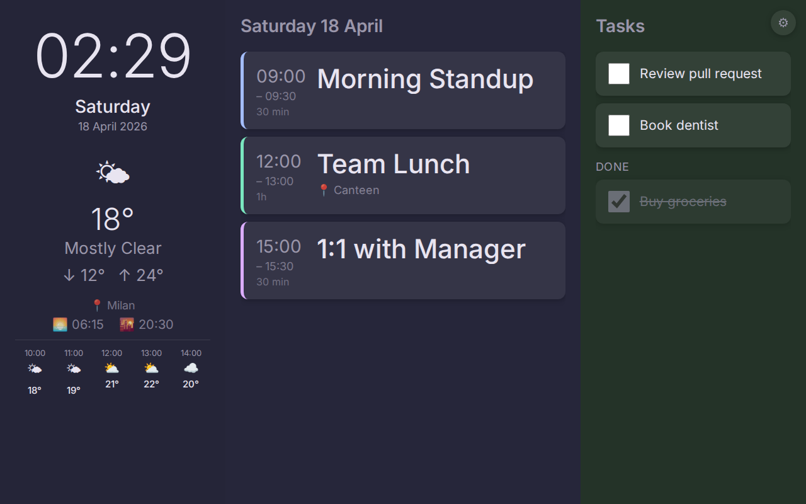

# Morning Dashboard

A personal kiosk app for a 10" landscape tablet. Shows today's calendar events, current time, weather, and tasks on a single screen.



---

## Features

- **Clock & date** — live clock, updates every second
- **Weather** — current conditions, min/max temperature, hourly forecast, sunrise/sunset, location name (Open-Meteo, no API key required)
- **Google Calendar** — today's events with time, duration, location, description preview; tap a card for full details
- **Google Tasks** — task list with checkbox completion; completed tasks shown in a "Done" section
- **Preferences** — gear icon opens a settings screen to toggle which calendars are shown; selections persist across restarts
- **Dark pastel theme** — easy on the eyes at arm's length

---

## Stack

| Layer | Technology |
|---|---|
| UI | React 18 + TypeScript |
| Build | Vite |
| Android APK | Capacitor 6 |
| Auth | Google Identity Services (browser OAuth2 popup) |
| Storage | Capacitor Preferences |
| Weather | Open-Meteo API (free, no key) |
| Geocoding | Nominatim / OpenStreetMap (free, no key) |
| Calendar & Tasks | Google Calendar REST v3 / Tasks REST v1 |
| Unit tests | Vitest + React Testing Library |
| E2E tests | Playwright |

---

## Getting Started

### 1. Clone and install

```bash
git clone <repo>
cd morning
npm install
```

### 2. Set up Google Cloud

See [SETUP.md](SETUP.md) for full instructions. In short:

1. Create a Google Cloud project
2. Enable **Google Calendar API** and **Tasks API**
3. Create an OAuth 2.0 Web client ID
4. Add `http://localhost:5173` as an Authorized JavaScript Origin
5. Add your Google account as a test user on the OAuth consent screen

### 3. Configure environment

```bash
cp .env.example .env
```

Edit `.env`:

```
VITE_GOOGLE_CLIENT_ID=your-client-id.apps.googleusercontent.com
```

### 4. Run

```bash
npm run dev
```

Open [http://localhost:5173](http://localhost:5173), click **Sign in with Google**.

---

## Android APK

```bash
npm run build
npx cap sync android
npx cap open android   # opens Android Studio
```

Build and deploy from Android Studio. For Android OAuth, also create an **Android** credential in Google Cloud with your app's SHA-1 fingerprint (see [SETUP.md](SETUP.md)).

---

## Scripts

| Command | Description |
|---|---|
| `npm run dev` | Start dev server |
| `npm run build` | Production build |
| `npm test` | Run unit tests (71 tests) |
| `npm run test:e2e` | Run Playwright e2e tests (16 tests) |
| `npm run test:e2e:ui` | Playwright test UI |
| `npm run screenshot` | Capture dashboard screenshot to `docs/screenshot.png` |

---

## Project Structure

```
src/
  App.tsx                     — root layout, auth gate, screen switching
  hooks/                      — data fetching and state hooks
  api/                        — Google Calendar, Tasks, Open-Meteo, geocoding
  components/
    LeftPanel/                — clock, date, weather, sun times
    CenterPanel/              — calendar events, event modal
    RightPanel/               — tasks
    PreferencesScreen/        — calendar toggles
  types/                      — TypeScript interfaces

e2e/                          — Playwright tests and fixtures
tests/                        — Vitest unit tests
```
